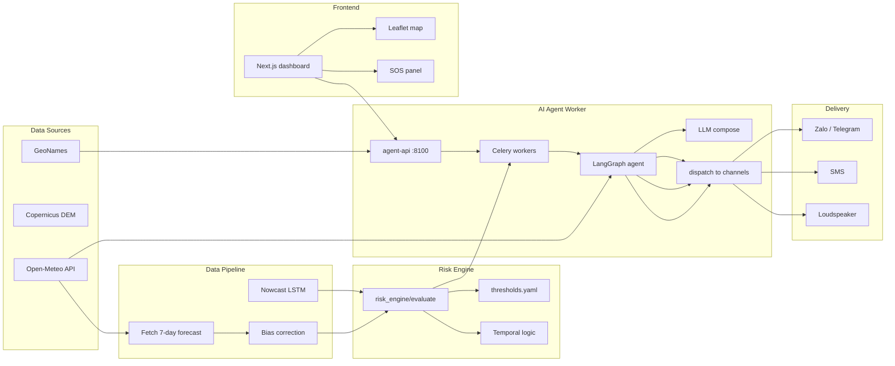

<div align="center">

# 🌤️ Dien Bien Weather AI

### *Know the sky, know the risk — A hundred calamities, a hundred victories*

[](https://fastapi.tiangolo.com/)
[](https://nextjs.org/)
[](https://langchain-ai.github.io/langgraph/)
[](https://docs.celeryq.dev/)
[](https://supabase.com/)
[](https://www.tensorflow.org/)
[](https://www.docker.com/)
[](https://www.python.org/)
[](LICENSE)

</div>

---

## 1. The Challenge

**Rapid-onset disasters across complex terrain**

Điện Biên is a mountainous province with dispersed communities and many areas frequently exposed to flash floods, landslides, dense fog, and severe cold. In just two periods of heavy rainfall between **25 July and 4 August 2025**, natural disasters in Điện Biên resulted in **10 deaths, 14 injuries, 1,401 affected houses**, and **estimated economic losses of ~VND 1.356 trillion**.

The challenge is not only forecasting the weather, but delivering warnings to the right people before they run out of time to act.

## 2. The Project

**Dien Bien Weather AI** is an AI-powered early-warning system that automatically delivers commune- and village-level weather risks to residents and local authorities through:

- **AI-powered warning maps** — Interactive commune-level risk maps visualized on the dashboard.
- **Online messaging apps** — Instant alerts via **Zalo** and **Telegram**.
- **SMS** — Direct text messages to residents in high-risk areas.
- **Local public loudspeakers** — Automated voice announcements via TTS broadcast.
- **SOS reporting button** — A resident-facing button for emergency reporting on the dashboard.

When risks emerge during the night or early morning—when fewer officials are on duty—the system can still automatically identify communes and villages facing danger, generate short warnings with clear recommended actions, send them simultaneously across all channels, and notify responsible officials through the government dashboard.


## 3. Key Differentiator: Immediate Warning

The core differentiator of **Dien Bien Weather AI** is its ability to act **instantly** when risks emerge — even during off-hours.

**The problem:** Dangerous weather often strikes at night or in the early morning when government offices are closed and fewer officials are on duty. Manual warning workflows — assess, draft, approve, disseminate — can take hours, by which time residents may already be in harm's way.

**How the system solves it:**

1. **Automated commune/village identification** — The risk engine continuously evaluates forecast, nowcast, and observation data for every commune, flagging any location that crosses a danger threshold.
2. **Instant bulletin generation** — The AI Agent (LangGraph + LLM) composes short, clear warnings in Vietnamese with specific recommended actions (e.g., "evacuate to shelter X", "avoid stream crossings"), tailored to each commune's hazard type and severity.
3. **Simultaneous multi-channel delivery** — Warnings are dispatched in parallel through Telegram, Zalo, SMS, and automated loudspeaker broadcasts — no manual routing needed.
4. **Official notification** — The government dashboard is updated in real time, and responsible commune/district officials receive a direct notification with the full situation report.

This means a flash flood or landslide detected at 2:00 AM can have a warning on loudspeakers and in residents' phones by 2:05 AM — without anyone having to be awake at a desk.

## 4. Repository Structure

```
.
├── backend/               # FastAPI backend
│   ├── app/               #   API routes, services, schemas, security
│   ├── risk_engine/       #   Deterministic risk engine (Decision 18/2021)
│   ├── pipeline/          #   Live/scenario/replay pipeline runner
│   ├── nowcast/           #   LSTM nowcast model (TensorFlow)
│   ├── fetchers/          #   Open-Meteo weather data fetcher
│   ├── downscale/         #   Quantile-mapping bias correction
│   ├── db/                #   Schema.sql for Supabase
│   └── scripts/           #   Build commune masks, fit quantile maps
├── agent_worker/          # AI Agent service (LangGraph + Celery)
│   ├── api.py             #   FastAPI control plane
│   ├── tasks.py           #   Celery tasks (run_job, resume_job, dispatch)
│   ├── graph/             #   LangGraph agent with tool-calling
│   ├── tools/             #   Agent tools (weather, geo, risk, telegram, speaker)
│   ├── ai/                #   LLM client, risk engine, TTS, chat model
│   ├── infra/             #   DB, messaging, config
│   └── shared/            #   Shared schemas (alert, forecast, geo)
├── data-pipeline/         # Standalone weather data pipeline
│   └── pipeline/          #   Fetch, bias-correction, geocode, run
├── frontend/              # Next.js 15 dashboard + map (Leaflet)
│   ├── app/               #   Next.js App Router pages
│   ├── components/        #   React components
│   ├── services/          #   API clients, data gateways
│   └── hooks/             #   React hooks
├── config/                # Shared configuration
│   └── thresholds.yaml    # Risk engine rule tables (QĐ18/2021)
├── tests/                 # Root-level E2E tests
│   ├── test_e2e.py        #   End-to-end pipeline tests
│   ├── test_model.py      #   Nowcast model tests
│   ├── test_run.py        #   Pipeline run tests
│   └── ...
├── pyproject.toml         # Risk engine project config
├── scaler.json            
└── requirements-tf.txt    # TensorFlow dependencies
```

## 5. Architecture & Data Flow



**Step-by-step flow:**
1. **Data ingestion:** `data-pipeline/pipeline/fetch.py` calls Open-Meteo API for 7-day forecasts. `backend/fetchers/openmeteo.py` fetches grid data for nowcasting (`backend/nowcast/`).
2. **Feature assembly:** `backend/pipeline/assemble.py` builds `RiskEngineInput` per commune combining observations, forecast, antecedent rain, and nowcast data.
3. **Risk evaluation:** `backend/risk_engine/engine.py:evaluate()` validates input, derives features, applies rule tables from `config/thresholds.yaml`, runs temporal logic, and produces `HazardAssessment` outputs with risk levels 0–5.
4. **Worker dispatch:** `agent_worker/api.py` receives warning requests, enqueues Celery tasks. `agent_worker/tasks.py` runs the LangGraph agent (`agent_worker/graph/`) which calls tools (risk engine, weather, geo, telegram), composes multi-lingual bulletins via LLM, and dispatches messages.
5. **Channel delivery:** Messages are sent via Telegram bot (`agent_worker/tools/telegram_tool.py`) or loudspeaker (`agent_worker/tools/speaker_tool.py` — currently mock). Retry logic runs inside `agent_worker/tasks.py:_dispatch()` with configurable max retry count.

## 6. Key Components

### Backend API (`backend/`) — [README](backend/README.md)
- FastAPI application with 12 API groups (auth, forecast, citizens, admins, alerts, shelters, notifications, rescue, loudspeakers, SOS, delivery log, system).
- Automatic seed on startup: 45 communes, 45 officials, 450 citizens, rescue teams.
- Health check at `GET /health`.
- Start: `uvicorn app.main:app --reload` (port 8000).

### Risk Engine (`backend/risk_engine/`) — [README](backend/risk_engine/README.md)
- Deterministic engine based on **Decision 18/2021/QĐ-TTg**.
- Input validation via JSON Schema (`backend/risk_engine/schemas.py`).
- Rule tables in `config/thresholds.yaml` (5 hazard types, 30+ rules).
- Multi-hazard compounding (`lu_quet_sat_lo` + `mua_lon` both ≥2 → +1 level).
- Temporal logic: cooldown, clearing, idempotency cache.
- Output: `HazardAssessment` with risk_level, risk_color, msg_type, CAP-XML.

### AI Agent Worker (`agent_worker/`) — [README](agent_worker/README.md)
- FastAPI control plane (port 8100) with Celery workers for background AI tasks.
- LangGraph agent with tool-calling (weather, risk, geo, shelter, telegram).
- Human-in-the-loop for high-level warnings (≥3).
- Telegram bot integration for citizen alerts.
- Retry logic: up to 3 attempts per dispatch with 5s countdown.

### Data Pipeline (`data-pipeline/`)
- Standalone pipeline to fetch 7-day weather forecasts for 45 communes.
- Bias correction via quantile mapping (`data-pipeline/pipeline/bias_correction.py`).
- Output: `output/forecast_<commune>.json` + `output/latest.json`.

### Frontend (`frontend/`)
- Next.js 15 App Router with Leaflet map.
- Resident dashboard: commune warning map, 7-day forecast, SOS button.
- Admin dashboard: monitor warnings, delivery status, rescue assignment.

## 7. Quick Start

### 7.1 Risk Engine standalone

```bash
cd backend
pip install -e ..
pytest tests/ -v                    # Run engine tests (determinism, rules, fuzz)
python -m pipeline.run --source scenario --scenario muong_pon  # Run Muong Pon scenario
```

### 7.2 Backend API

```bash
cd backend
python -m venv .venv && .venv\Scripts\activate
pip install -r requirements.txt
cp .env.example .env
uvicorn app.main:app --reload       # → http://localhost:8000/docs
```

### 7.3 AI Agent Worker

```bash
cd agent_worker
docker compose up --build            # Starts agent-api:8100 + workers + RabbitMQ + Redis + Postgres
# Swagger: http://localhost:8100/docs
```

### 7.4 Frontend

```bash
cd frontend
npm install
npm run dev                          # → http://localhost:3000
```

## 8. Deployment

| Component | Method | Reference |
|-----------|--------|-----------|
| Frontend | Vercel | `frontend/vercel.json` |
| Backend | Render / Docker | `backend/Dockerfile`, `backend/render.yaml` |
| AI Agent | Docker Compose | `agent_worker/docker-compose.prod.yml` |
| Database | Supabase | `backend/db/schema.sql` |

See [docs/DEPLOYMENT.md](docs/DEPLOYMENT.md) for full instructions.

## 9. License

[MIT License](LICENSE) © 2026 Quoc-Viet-Anh Tran.
