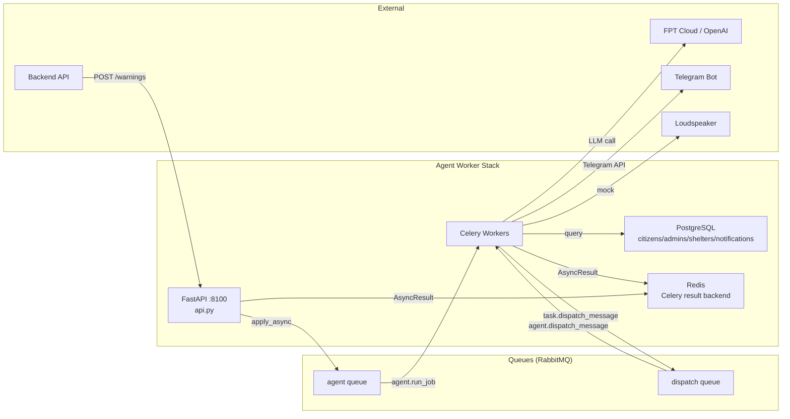

# AI Agent Worker — Dien Bien Weather AI

The AI Agent Worker is a **Celery-based background job system** that receives warning requests, runs a LangGraph agent with tool-calling, composes multi-lingual bulletins, and dispatches alerts to residents. It runs alongside the backend API and operates through Celery queues (RabbitMQ in local dev, Redis in production).

## 🌐 Live Deployment

- **AI Agent API (Render):** https://quto-ai-2.onrender.com · [Swagger](https://quto-ai-2.onrender.com/docs) · [Health](https://quto-ai-2.onrender.com/health)
- Deployed as a **single Render web service** running FastAPI + Celery worker together via `honcho` (`Procfile`). Broker/result = **Render Key Value (Redis)**, data = **Render Postgres**, LLM = **FPT Cloud**.
- Setup guide: [RENDER.md](RENDER.md) · full guide: [docs/DEPLOYMENT.md](../docs/DEPLOYMENT.md).

---

## 1. Architecture



### Key Design Decisions

- **Asynchronous + polling:** `POST /warnings` enqueues a Celery job and returns `warning_id` immediately. The caller polls `GET /warnings/{id}` for status.
- **Human-in-the-loop:** Risk levels ≥ `HUMAN_APPROVAL_MIN_LEVEL` (default 3) require official approval before dispatch.
- **Two queues:** `agent` queue for AI graph execution, `dispatch` queue for fan-out message delivery.
- **Retry + fallback:** Failed dispatches retry up to 3 times with 5s countdown. If exhausted, marked as `failed` with "cần đến tận nhà" (requires home visit).
- **No LLM in risk decisions:** The LLM only composes bulletins. Risk level is determined by the deterministic risk engine.

## 2. File Map

| File | Purpose |
|------|---------|
| `api.py` | FastAPI control plane (port 8100): health, seed, warnings CRUD, Telegram, citizens/admins/shelters/notifications data endpoints |
| `tasks.py` | **Celery tasks**: `run_agent_job` (agent queue), `resume_agent_job` (approve/reject), `dispatch_message` (dispatch queue) |
| `celery_app.py` | Celery app configuration (broker: RabbitMQ, backend: Redis) |
| `config.py` | Worker settings: `human_approval_min_level`, `dispatch_max_retry`, broker URLs |
| `data_repo.py` | Async database access (citizens, admins, shelters, notifications, link tokens) |
| `repo.py` | Span/run/report repository (LLM trace storage) |
| `graph/` | LangGraph agent implementation |
| `graph/build.py` | Graph definition (nodes, edges, tools) |
| `graph/runner.py` | Graph execution helper, `_finalize()`, `build_dispatch_messages()`, `summarize()` |
| `graph/nodes.py` | Progress tracking, span context, Celery update_state |
| `graph/agent_tools.py` | Tool registry, `run_ctx` context variable |
| `graph/state.py` | Graph state schema |
| `tools/` | Agent tools |
| `tools/telegram_tool.py` | Telegram Bot API client |
| `tools/speaker_tool.py` | Loudspeaker tool (mock implementation) |
| `tools/weather_tool.py` | Weather forecast tool |
| `tools/geo_tool.py` | Geographical lookup tool |
| `tools/risk_engine_tool.py` | Risk evaluation tool |
| `tools/shelter_tool.py` | Nearest shelter tool |
| `tools/recommend_tool.py` | Action recommendation tool |
| `tools/message_formatter.py` | Multi-lingual bulletin formatter |
| `tools/maps_tool.py` | Map image generation |
| `tools/user_api_tool.py` | User data API tool |
| `ai/` | LLM integration |
| `ai/llm.py` | LLM client (FPT Cloud OpenAI-compatible) |
| `ai/chat_model.py` | Chat model configuration |
| `ai/risk_engine.py` | Local risk evaluation (used by agent tool) |
| `ai/tts.py` | Text-to-speech (mock) |
| `ai/tai_dam.py` | Dam-specific risk evaluation |
| `infra/` | Infrastructure |
| `infra/db.py` | PostgreSQL async engine & model initialization |
| `infra/messages.py` | Celery message schemas (`AgentJobRequest`, `DispatchMessage`, `AgentControlCommand`) |
| `shared/` | Shared domain models |
| `shared/alert.py` | `HazardEvent`, `Provenance` |
| `shared/common.py` | Enums: Hazard, risk_meta |
| `shared/forecast.py` | `ForecastResponse`, `DailyForecast` |
| `shared/geo.py` | `Commune` schema |
| `shared/geo_data.py` | 45 commune definitions |
| `shared/weather.py` | Weather data schemas |
| `docker-compose.yml` | Development stack (RabbitMQ + Redis + Postgres + 3 workers) |
| `docker-compose.prod.yml` | Production stack (Redis-only, no RabbitMQ) |
| `Dockerfile` | Container build |

## 3. Job Lifecycle

### Job States

| State | Meaning | Transitions |
|-------|---------|-------------|
| `PENDING` | Enqueued, waiting for Celery worker | → `PROGRESS` |
| `PROGRESS` | Agent graph is running (tools being called) | → `SUCCESS` or `FAILURE` |
| `SUCCESS` | Agent completed; status depends on risk level | See status below |
| `FAILURE` | Unrecoverable error (exception in graph) | Dead letter |
| `PROGRESS` (resume) | Wait for human approval | → `SUCCESS` (approve/reject) |

### Status Values (in result)

| Status | Meaning | Next Action |
|--------|---------|-------------|
| `no_risk` | No hazards detected | None |
| `pending_approval` | High-level warning, waiting for official | `POST /warnings/{id}/approve` or `/reject` |
| `dispatching` | Approved, sending messages | Poll `GET /warnings/{id}` |
| `approved` | Low-level warning, auto-dispatched | None |
| `rejected` | Official rejected the warning | None |

### Dispatch Retry Logic (`tasks.py:_dispatch`)

```python
# From tasks.py (lines 104-126):
# 1. Try sending via Telegram or loudspeaker
# 2. If failed and attempt+1 < max_retry (3): re-enqueue with countdown=5
# 3. If all retries exhausted: mark notification as 'failed'
#    with note "hết lượt — cần đến tận nhà" (requires home visit)
```

## 4. API Endpoints

Live at `https://quto-ai-2.onrender.com` · local dev at `http://localhost:8100`. Swagger at `/docs`.

### System

| Method | Endpoint | Description |
|--------|----------|-------------|
| `GET` | `/health` | Returns `{"status":"ok","broker":"...","backend":"redis"}` |

### Warnings (AI Agent)

| Method | Endpoint | Description |
|--------|----------|-------------|
| `POST` | `/warnings` | Create warning. Body: `{commune_code, langs, trigger, forecast}`. Returns `warning_id`. |
| `GET` | `/warnings/{id}` | Poll job status: `{state, status, progress, result}` |
| `POST` | `/warnings/{id}/approve` | Approve & dispatch. Optional `edited_body_vi` to modify Vietnamese bulletin. |
| `POST` | `/warnings/{id}/reject` | Reject warning. |

### Data

| Method | Endpoint | Description |
|--------|----------|-------------|
| `POST` | `/seed` | Seed demo data (idempotent) |
| `GET` | `/citizens?commune_code=` | Citizens by commune |
| `GET` | `/admins?commune_code=` | Officials by commune |
| `GET` | `/shelters/nearest?commune_code=&lat=&lon=` | Nearest shelter |
| `GET` | `/notifications?warning_id=&cccd=&failed_only=` | Sent notifications |

### Telegram

| Method | Endpoint | Description |
|--------|----------|-------------|
| `GET` | `/telegram/invite-links?commune_code=` | Generate opt-in links |
| `POST` | `/telegram/sync-subscribers` | Sync Telegram chat IDs |
| `GET` | `/telegram/updates` | View recent updates |

## 5. Quick Start

### Development (Docker Compose)

```bash
cd agent_worker
docker compose up --build
# Services:
#   agent-api        : http://localhost:8100/docs
#   RabbitMQ UI      : http://localhost:15672  (guest/guest)
```

### Verification Script

```bash
# 1. Seed data
curl -s -X POST http://localhost:8100/seed | python -m json.tool

# 2. Create a warning (enqueues Celery job)
JOB=$(curl -s -X POST http://localhost:8100/warnings \
  -H "Content-Type: application/json" \
  -d '{"commune_code":"muong_pon","langs":["vi","tai","hmn"],"trigger":"test"}')
echo "$JOB"
WARN_ID=$(echo "$JOB" | python -c "import sys,json;print(json.load(sys.stdin)['warning_id'])")

# 3. Poll until complete
sleep 5
curl -s "http://localhost:8100/warnings/$WARN_ID" | python -m json.tool

# 4. If pending_approval, approve it
curl -s -X POST "http://localhost:8100/warnings/$WARN_ID/approve" \
  -H "Content-Type: application/json" \
  -d '{"note":"Approved for testing"}' | python -m json.tool
```

### JSON Output Examples

**After creating a warning (no-risk scenario):**
```json
{"warning_id":"alt_abc123","state":"SUCCESS","status":"no_risk","progress":null,
 "result":{"risk_level":0,"needs_human":false,"n_recipients":0}}
```

**Pending approval (high risk, e.g., level 3):**
```json
{"warning_id":"alt_def456","state":"SUCCESS","status":"pending_approval",
 "result":{"risk_level":3,"needs_human":true}}
```

**After approval (dispatching):**
```json
{"warning_id":"alt_def456","state":"SUCCESS","status":"dispatching",
 "result":{"risk_level":3,"needs_human":true,"n_recipients":15}}
```

## 6. Logging & Monitoring

Worker logs are available via Docker:

```bash
docker compose logs -f agent-worker
docker compose logs -f dispatch-worker
```

Each job creates trace spans in PostgreSQL (`runs`, `spans` tables) recording tool calls, LLM thinking, token usage, and latency.

## 7. Production Deployment

See [docs/DEPLOYMENT.md](../docs/DEPLOYMENT.md) for production configuration.

```bash
cd agent_worker
cp .env.example .env
# Edit .env for production settings
docker compose -f docker-compose.prod.yml up -d
```

## 8. Completed vs. Mock vs. Unimplemented

| Feature | Status | Details |
|---------|--------|---------|
| Celery task queue | ✅ Complete | RabbitMQ broker, Redis result backend, 2 queues |
| LangGraph agent graph | ✅ Complete | Tool-calling agent with 10 tools |
| Risk engine tool | ✅ Complete | Deterministic QĐ18 rule evaluation |
| Weather tool | ✅ Complete | Open-Meteo forecast integration |
| Telegram dispatch | ✅ Complete | Real Telegram Bot API (via `python-telegram-bot`) |
| Telegram opt-in | ✅ Complete | Link token generation, chat_id sync |
| LLM bulletin composition | ✅ Complete | FPT Cloud / OpenAI API |
| Geo tool | ✅ Complete | 45 commune definitions |
| Shelter tool | ✅ Complete | Haversine nearest-shelter |
| Human-in-the-loop | ✅ Complete | Pending → approve/reject flow |
| Job polling | ✅ Complete | PROGRESS state with node info |
| Retry & fallback | ✅ Complete | 3 retries with 5s countdown |
| Dispatch trace spans | ✅ Complete | PostgreSQL span storage |
| Loudspeaker delivery | ⚠️ Mock | Returns mock status (no real IP speaker) |
| TTS (text-to-speech) | ⚠️ Mock | Returns placeholder audio metadata |
| SMS delivery | ❌ Not implemented | Channel exists but not wired |
| Zalo ZNS delivery | ❌ Not implemented | Requires Zalo OA API credentials |
