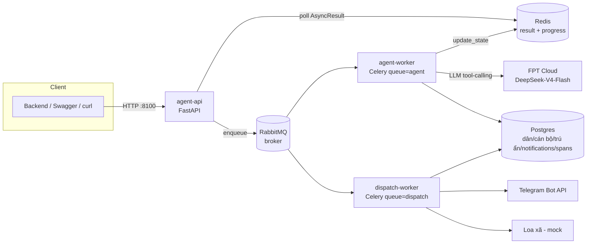
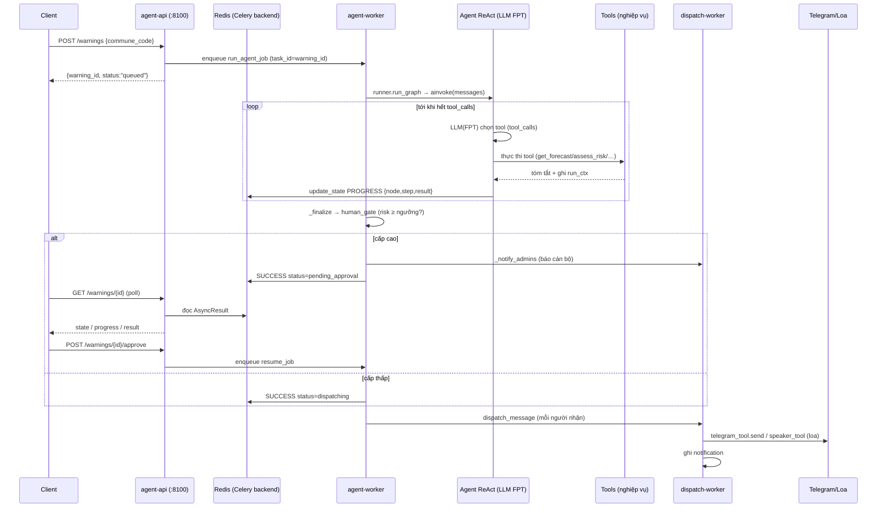
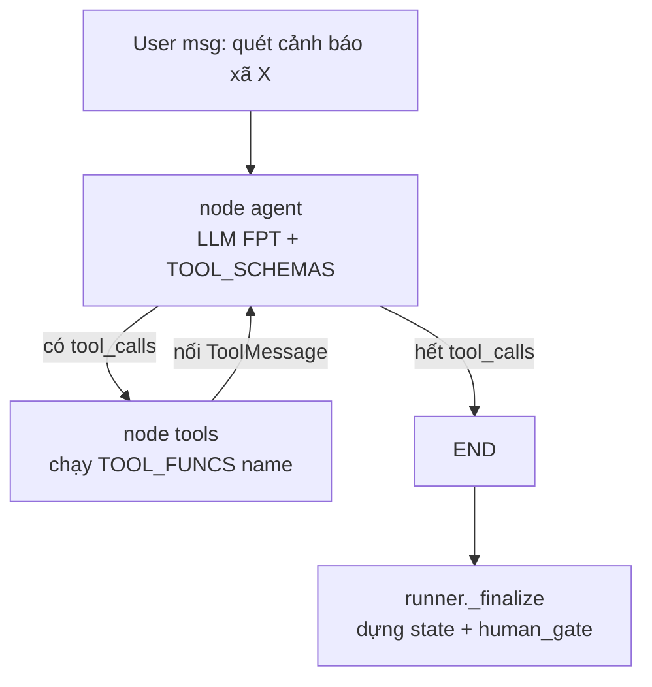
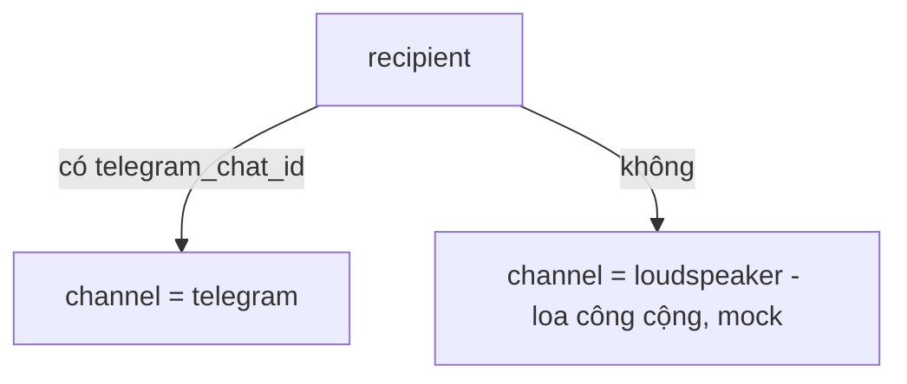
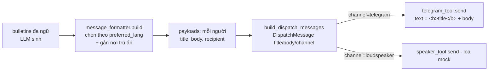

# Quto AI — Logic thực thi của Agent theo từng API

Tài liệu mô tả **luồng xử lý bên trong** của `agent_worker`: API nào chạy AI agent, agent gọi
tool ra sao, khi nào chờ duyệt và khi nào gửi. Phản ánh code hiện tại (agent tool-calling ReAct
trên LangGraph, gọi LLM qua FPT Cloud OpenAI-compatible).

---

## 1. Tổng quan kiến trúc



| Thành phần | Vai trò |
|---|---|
| **agent-api** (`:8100`) | FastAPI + Swagger. Nhận request, đẩy job cho Celery, cho polling. |
| **agent-worker** | Celery queue `agent` — chạy **AI agent** (vòng tool-calling) + soạn bản tin. |
| **dispatch-worker** | Celery queue `dispatch` — gửi bản tin tới từng người (Telegram/loa) + retry. |
| **RabbitMQ** | Broker hàng đợi task. |
| **Redis** | Celery result backend — lưu `state` + `progress` + `result` để **polling**. |
| **Postgres** | Dữ liệu nghiệp vụ + vết LLM (`agent_runs`/`agent_spans`). |
| **FPT Cloud** | LLM (OpenAI-compatible) — điều phối tool-calling + sinh bản tin. |

Nguyên tắc thiết kế:
- **Bất đồng bộ + polling**: API không chờ agent; trả `warning_id` ngay, client poll `GET /warnings/{id}`.
- **Agent chỉ phân tích + soạn tin**, KHÔNG tự gửi. Việc gửi do tầng task quyết sau khi **cán bộ duyệt**.
- **An toàn cảnh báo**: cấp độ rủi ro do risk engine (QĐ18) quyết, không phải LLM.

---

## 2. Vòng đời một cảnh báo (xương sống)

Ba pha:

- **(A) Submit** — `POST /warnings` sinh `warning_id`, đẩy task `run_agent_job` (Celery, `task_id=warning_id`), trả ngay `{warning_id, status:"queued"}`.
- **(B) Agent chạy nền** — `run_agent_job` → `runner.run_graph` → **vòng ReAct** (agent gọi 5 tool) → `_finalize` (human_gate). Cấp ≥ ngưỡng (`HUMAN_APPROVAL_MIN_LEVEL`, mặc định 3) → **báo admin** + `pending_approval`; cấp thấp → dispatch ngay.
- **(C) Poll & Duyệt** — client poll `GET /warnings/{id}` (đọc Redis). Cán bộ `POST /warnings/{id}/approve` → `resume_agent_job` → fan-out `dispatch_message` tới từng người → Telegram/loa.



---

## 3. Chi tiết agent tool-calling (ReAct)

Agent là graph LangGraph **2 node**, LLM gọi trực tiếp qua **thư viện `openai`** tới FPT
(`tools=`, `tool_choice="auto"`, `temperature=0`):

- Node **`agent`** ([ai/chat_model.py](../ai/chat_model.py)) — gọi LLM kèm `TOOL_SCHEMAS` + `SYSTEM_PROMPT`. Trả assistant message (có thể chứa `tool_calls`).
- Node **`tools`** — với mỗi `tool_call`, chạy hàm tương ứng trong `TOOL_FUNCS` ([graph/agent_tools.py](../graph/agent_tools.py)), nối `ToolMessage` (kết quả) vào hội thoại.
- Điều kiện: còn `tool_calls` → `tools`; hết → `END`. Sau đó `runner._finalize` chạy human_gate.



### 5 tool (mỗi tool bọc đúng hàm nghiệp vụ cũ — logic không đổi)

Dữ liệu lớn (forecast/recipients/bulletins) **không đi qua token LLM**: tool đọc/ghi vào
`run_ctx` (ContextVar per-job), chỉ trả **tóm tắt ngắn** để LLM suy luận bước kế.

| # | Tool | Bọc hàm nghiệp vụ | Đọc `run_ctx` | Ghi `run_ctx` | Trả về LLM |
|---|------|-------------------|---------------|---------------|------------|
| 1 | `get_forecast` | `geo_tool.get_commune` + `weather_tool.get_forecast` | `commune_code` | `commune`, `forecast` | nguồn + số ngày dự báo |
| 2 | `assess_risk` | `risk_engine_tool.evaluate` / `top_event` (QĐ18) | `forecast`, `commune` | `hazard_events`, `top_event`, `risk_level`, `alert_id` | hazard + cấp, hoặc `no_risk → DỪNG` |
| 3 | `recommend_actions` | `recommend_tool.lookup` | `top_event`, `commune` | `actions` | danh sách hành động |
| 4 | `get_recipients` | `user_api_tool.citizens/admins` + `shelter_tool.nearest_for_commune` | `commune_code` | `recipients{citizens,admins,shelters}` | n_dân, n_cán_bộ |
| 5 | `compose_bulletins` | `ai/llm.generate_bulletins_with_meta` + `message_formatter.build` + `repo.update_alert_bulletins` | `top_event`, `actions`, `recipients`, `langs` | `bulletins`, `payloads` | tiêu đề (vi) + số ngôn ngữ |

Thứ tự khuyến nghị (ép bởi `SYSTEM_PROMPT`):
`get_forecast → assess_risk → [nếu có nguy cơ] recommend_actions → get_recipients → compose_bulletins`.

### SYSTEM_PROMPT (nguyên văn)

Đây là system message gửi kèm mỗi lượt gọi LLM ([ai/chat_model.py](../ai/chat_model.py)):

```text
Bạn là AGENT cảnh báo thiên tai cấp xã của tỉnh Điện Biên. Nhiệm vụ: quét nguy cơ và
SOẠN bản tin cảnh báo — KHÔNG tự gửi cho ai.

Quy trình BẮT BUỘC, gọi tool theo đúng thứ tự:
1) get_forecast — lấy dự báo thời tiết của xã.
2) assess_risk — đánh giá nguy cơ theo QĐ18. Đây là NGUỒN DUY NHẤT quyết định có/không
   nguy cơ và cấp độ; bạn KHÔNG được tự suy diễn cấp độ.
   • Nếu assess_risk báo KHÔNG có nguy cơ (no_risk) → DỪNG NGAY, trả lời ngắn gọn,
     KHÔNG gọi tool nào nữa.
   • Nếu CÓ nguy cơ → tiếp tục:
3) recommend_actions — tra khuyến nghị hành động.
4) get_recipients — lấy dân + cán bộ + nơi trú ẩn.
5) compose_bulletins — soạn bản tin đa ngữ. Sau bước này thì HOÀN TẤT, dừng lại.

TUYỆT ĐỐI KHÔNG bịa số liệu, không đổi cấp độ rủi ro, không gọi tool gửi (không tồn tại).
Mỗi tool chỉ cần gọi một lần. Khi xong, trả lời một câu tóm tắt.
```

### Mô tả tool mà LLM đọc (trong `TOOL_SCHEMAS`)

Mỗi tool gửi cho LLM dưới dạng OpenAI function schema `{name, description, parameters}`.
Tất cả tool **không nhận tham số** (`parameters` rỗng) — dữ liệu lấy từ `run_ctx`. `description`
(nguồn: `agent_tools._TOOLS`) chính là thứ LLM dựa vào để quyết định gọi:

| Tool (`name`) | `description` gửi cho LLM |
|---|---|
| `get_forecast` | Lấy thông tin xã + dự báo thời tiết. Gọi ĐẦU TIÊN. |
| `assess_risk` | Đánh giá nguy cơ theo QĐ18 (nguồn DUY NHẤT quyết định cấp độ). Nếu no_risk thì DỪNG. |
| `recommend_actions` | Tra khuyến nghị hành động (khi có nguy cơ). |
| `get_recipients` | Lấy dân + cán bộ + nơi trú ẩn của xã. |
| `compose_bulletins` | Soạn bản tin đa ngữ. Gọi CUỐI CÙNG. Không gửi tin. |

> Ngoài `description` ngắn này, mỗi hàm tool còn có docstring dài hơn trong code (giải thích chi
> tiết, ví dụ "nếu no_risk → DỪNG quy trình") — nhưng thứ LLM nhận qua schema là cột bảng trên.

Ví dụ 1 schema (get_forecast):
```json
{ "type": "function",
  "function": { "name": "get_forecast",
    "description": "Lấy thông tin xã + dự báo thời tiết. Gọi ĐẦU TIÊN.",
    "parameters": { "type": "object", "properties": {}, "required": [] } } }
```

### Ràng buộc an toàn

- **`assess_risk` là nguồn DUY NHẤT** quyết định có/không nguy cơ + cấp độ. LLM **không** tự đặt cấp.
- `no_risk` → agent dừng; `_finalize` tất định đặt `status="no_risk"` và **KHÔNG dispatch**.
- Agent **không có tool gửi** — gửi do `tasks.py` quyết định **sau khi cán bộ duyệt**.
- `recursion_limit=25` chặn lặp vô hạn; `temperature=0` cho ổn định.
- Mỗi bước tool đều mở **span** (ghi `agent_spans`) + phát **progress** (Redis) → trace + polling.

---

## 4. Chi tiết từng API

Base URL: `http://localhost:8100`. Swagger: `/docs`.

### 4.1. Cảnh báo (AI)

#### `POST /warnings` — tạo cảnh báo (submit)
- **Mục đích**: đẩy job cho agent, trả `warning_id` ngay (không chờ).
- **Input**:
  ```json
  { "commune_code": "muong_pon", "langs": ["vi","tai","hmn"],
    "commune": null, "forecast": null, "trigger": "manual" }
  ```
  `commune`/`forecast` tùy chọn (backend đính kèm sẵn → agent khỏi gọi lại).
- **Output**: `{ "warning_id": "alt_xxxxxxxxxxxx", "status": "queued" }`
- **Luồng nội bộ**: `create_warning` sinh `warning_id` → `tasks.run_agent_job.apply_async(task_id=warning_id, queue="agent")` → mục **§2 pha B**.

#### `GET /warnings/{warning_id}` — polling
- **Mục đích**: đọc trạng thái + tiến độ + kết quả từ Redis (Celery `AsyncResult`). Gọi lặp tới khi `state=SUCCESS`.
- **Output** (đang chạy):
  ```json
  { "warning_id":"alt_x", "state":"PROGRESS", "status":"running",
    "progress":{"node":"assess_risk","step":2,"total":5},
    "result":{"risk_level":4,"hazard":"flash_flood","top_event":{}}, "resume":null }
  ```
  **Output** (chờ duyệt):
  ```json
  { "warning_id":"alt_x", "state":"SUCCESS", "status":"pending_approval", "progress":null,
    "result":{"risk_level":4,"needs_human":true,"bulletins":[/*vi,tai,hmn*/],"n_recipients":3},
    "resume":null }
  ```
- **Luồng nội bộ**: đọc `AsyncResult(warning_id)` + `AsyncResult("{id}:resume")`; gộp `state` Celery → `status` nghiệp vụ (xem §5). Khi PROGRESS, `result` là metadata **tích lũy** tới tool hiện tại.

#### `POST /warnings/{warning_id}/approve` — cán bộ duyệt & gửi
- **Input**: `{ "admin_id":"canbo", "edited_body_vi": null, "note": null }` (có thể sửa nội dung tiếng Việt trước khi gửi).
- **Output**: `{ "warning_id":"alt_x", "status":"approving" }` → poll GET để thấy `dispatching`.
- **Luồng nội bộ**: `tasks.resume_agent_job` (action=`approve`, `task_id="{id}:resume"`) → lấy `dispatch_plan` từ kết quả run_job → fan-out `dispatch_message` cho từng người → §6.

#### `POST /warnings/{warning_id}/reject` — bác bỏ
- **Input**: `{ "admin_id":"canbo", "note": "lý do" }`
- **Output**: `{ "warning_id":"alt_x", "status":"rejecting" }`
- **Luồng nội bộ**: `resume_agent_job` (action=`reject`) → cập nhật run status `rejected`, **không gửi**.

### 4.2. Telegram (đăng ký & gửi)

> Ràng buộc Telegram: bot chỉ nhắn được cho người **đã Start bot**. Onboarding dùng token ngẫu nhiên (không chứa CCCD).

#### `GET /telegram/invite-links?commune_code=...`
- **Mục đích**: sinh `telegram_link_token` (nếu chưa có) cho từng công dân của xã, trả link `https://t.me/<bot>?start=<token>`.
- **Output**: `{ commune_code, bot_username, n, links:[{full_name, link, token}] }` (KHÔNG trả CCCD).
- **Luồng nội bộ**: `data_repo.ensure_link_tokens` + `telegram_tool.get_me` lấy username.

#### `POST /telegram/sync-subscribers`
- **Mục đích**: đọc `getUpdates` của bot; với ai đã `/start <token>` → tra token → công dân → lưu `telegram_chat_id`.
- **Output**: `{ mapped, subscribers:[{full_name, chat_id}], unmatched:[...], seen_updates }`.
- **Luồng nội bộ**: `telegram_tool.get_updates` → `data_repo.set_telegram_chat_id_by_token`.

#### `GET /dev/telegram-updates`
- Xem update gần đây của bot (tìm `chat_id` / debug). Output: `{ updates:[{chat_id, name, start_payload, text}] }`.

#### `POST /dev/telegram-test`
- Gửi 1 tin Telegram thẳng tới `chat_id` (bỏ qua graph) để kiểm cấu hình.
- **Input**: `{ "chat_id":"...", "text":"..." }` → **Output**: `DispatchRecord` (`{channel,target,delivered,status,detail}`).

### 4.3. Dữ liệu / hệ thống

| API | Mục đích | Luồng nội bộ |
|---|---|---|
| `GET /health` | Kiểm tra sống | trả broker + backend |
| `POST /seed` | Nạp dữ liệu mẫu (dân/cán bộ/trú ẩn) — idempotent | `init_models` + `data_repo.seed` |
| `GET /citizens?commune_code=` | Danh sách công dân theo xã | `data_repo.citizens_by_commune` |
| `GET /admins?commune_code=` | Cán bộ phụ trách xã | `data_repo.admins_for_commune` |
| `GET /shelters/nearest?commune_code=&lat=&lon=` | Nơi trú ẩn gần nhất | `data_repo.nearest_shelter` (haversine) |
| `GET /notifications?warning_id=&cccd=&failed_only=` | Tin đã gửi tới từng người | `data_repo.list_notifications` |

---

## 5. Trạng thái & polling

`GET /warnings/{id}` gộp `state` (Celery, ở Redis) thành `status` nghiệp vụ dễ đọc:

| `state` (Celery) | Ý nghĩa | `status` nghiệp vụ |
|---|---|---|
| `PENDING` | Chưa chạy / đang chờ worker | `queued` |
| `PROGRESS` | Đang chạy 1 tool (`progress.node/step/total`) | `running` |
| `SUCCESS` | Xong (đọc `result.status`) | `pending_approval` \| `dispatching` \| `no_risk` \| `approved` |
| `FAILURE` | Lỗi | `failed` |
| task `:resume` SUCCESS | Đã duyệt/bác | `dispatching` \| `rejected` |

- `progress` = `{node, step, total}` — `total=5` (số tool), `step` theo `nodes._STEP`. Chỉ mang tính hiển thị (agent có thể gọi lệch).
- `result` khi PROGRESS = metadata **tích lũy** tới tool hiện tại; khi SUCCESS = kết quả đầy đủ (bỏ `dispatch_plan` nội bộ).
- Cơ chế: mỗi tool gọi `nodes._record(...)` (gom kết quả) + `nodes._emit(...)` (đẩy PROGRESS lên Redis qua `progress_hook` → `self.update_state`).

---

## 6. Định tuyến kênh gửi (dispatch)

`runner.primary_channel(recipient)` chọn kênh cho mỗi người:



- `dispatch_message` → `telegram` dùng `telegram_tool.send`; `loudspeaker` dùng `speaker_tool.send` (mock).
- **Thất bại + retry**: còn lượt (`< DISPATCH_MAX_RETRY`) → re-enqueue (countdown 5s); hết lượt → ghi notification `failed` (gợi ý "đến tận nhà").
- Mỗi lần gửi ghi 1 bản ghi vào bảng `notifications` (xem `GET /notifications`).

### Nội dung tin gửi đi được format ở đâu?

Nội dung mỗi tin **KHÔNG do kênh tự sinh** — nó được `message_formatter.build` (formatter dùng
chung mọi kênh) tạo ngay trong tool `compose_bulletins`:



- `message_formatter.build` chọn bản tin đúng `preferred_lang` của từng người + nối dòng **nơi trú ẩn gần nhất**, ra `title` + `body`.
- `telegram_tool.send(recipient, title, body)` bọc thành HTML: `"<b>{title}</b>\n{body}"` rồi gọi Telegram Bot API `sendMessage` (`parse_mode="HTML"`).
- Vậy: **Telegram nhận đúng nội dung đã format bởi `message_formatter`** (không phải chuỗi thô). Cùng payload đó nếu là kênh loa thì `speaker_tool` (mock) xử lý.
- **Báo admin**: khi `pending_approval`, `tasks._notify_admins` ghi notification `admin_review` cho cán bộ (và gửi Telegram nếu admin có `telegram_chat_id`) TRƯỚC khi gửi dân.

---

## 7. Cấu hình LLM (FPT Cloud)

Agent + soạn bản tin dùng chung 1 client OpenAI-compatible qua `config.openai_client_params()`:

```env
LLM_PROVIDER=fpt                                  # openai | local | fpt
FPT_API_KEY=sk-...                                # key FPT Cloud
FPT_BASE_URL=https://mkp-api.fptcloud.com/v1/
FPT_MODEL=DeepSeek-V4-Flash                        # model hỗ trợ tool-calling
```

- `provider=fpt` → dùng `FPT_*`; `openai`/`local` → dùng `OPENAI_*`.
- Model **bắt buộc hỗ trợ tool-calling** (đã kiểm: DeepSeek-V4-Flash trả `tool_calls` đúng chuẩn).
- `mock` KHÔNG chạy được agent (agent cần function-calling).

---

## 8. Xem output / log của Agent

Có 4 kênh quan sát, từ "sống" (real-time) tới "chi tiết đầy đủ":

### 8.1. Log Celery worker (real-time, nhanh nhất)
```bash
docker compose logs -f agent-worker      # agent chạy graph + tool
docker compose logs -f dispatch-worker   # gửi Telegram/loa
```
Agent **tự log** từng bước ra stdout (logger `agent_worker.agent` / `agent_worker.tasks`, mức INFO):
```
▶️  job alt_xxx BẮT ĐẦU — xã=muong_pon, langs=vi,tai,hmn, trigger=manual
🧠 agent quyết định gọi tool: get_forecast
🔧 get_forecast → Đã lấy dự báo cho xã Xã Mường Pồn: nguồn ..., 7 ngày.
🧠 agent quyết định gọi tool: assess_risk
🔧 assess_risk → Có nguy cơ: flash_flood cấp 4 ... alert_id=alt_...
... (recommend_actions → get_recipients → compose_bulletins)
🧠 agent kết thúc: Đã hoàn tất cảnh báo...
✅ job alt_xxx [muong_pon]: cấp 4 → PENDING_APPROVAL, 3 tin chờ duyệt (đã báo admin)
```
Ngoài ra có vòng đời task Celery + `log.warning` (báo admin lỗi, Telegram fail). Tăng chi tiết:
`--loglevel=debug` (command worker trong `docker-compose.yml`).

**Xem chính LLM gọi gì (request/response + tool_calls)** — bật log HTTP của openai SDK:
```yaml
# docker-compose.yml → environment của agent-worker
OPENAI_LOG: debug
```
→ log in ra từng request tới FPT + `tool_calls` model trả về. (Chỉ bật khi debug — rất nhiều log.)

### 8.2. Trace chi tiết trong Postgres (`agent_runs` + `agent_spans`) ⭐
Đây là **nhật ký đầy đủ nhất**: mỗi tool/LLM call ghi 1 span (input/output/thinking/latency/tokens).
`run_id = warning_id`. Mở psql:
```bash
docker compose exec postgres psql -U quto -d quto
```
```sql
-- Tổng quan các lần chạy gần đây
SELECT id, commune_code, status, risk_level, alert_id, total_tokens, created_at
FROM agent_runs ORDER BY created_at DESC LIMIT 10;

-- Toàn bộ bước của 1 cảnh báo (theo thứ tự) — thấy agent gọi tool nào, kết quả gì
SELECT seq, kind, name, status, latency_ms, left(coalesce(content,''), 80) AS preview
FROM agent_spans WHERE run_id = 'alt_xxx' ORDER BY seq;

-- Input/output đầy đủ 1 tool (jsonb)
SELECT name, input, output FROM agent_spans
WHERE run_id = 'alt_xxx' AND kind IN ('tool','node') ORDER BY seq;

-- Bản tin LLM sinh + "thinking" (nếu có)
SELECT content, thinking, output FROM agent_spans
WHERE run_id = 'alt_xxx' AND kind = 'llm';
```
`kind`: `node` (mỗi tool) · `tool` (I/O con: weather/risk_engine/…) · `llm` (soạn bản tin).

### 8.3. Live qua polling API (tiến độ + kết quả tích luỹ)
```bash
curl localhost:8100/warnings/alt_xxx
```
→ `state`/`status` + `progress{node,step,total}` + `result` lớn dần theo tool (xem §5). Không cần DB.

### 8.4. Redis (raw Celery result/meta)
```bash
docker compose exec redis redis-cli
> KEYS celery-task-meta-*
> GET celery-task-meta-alt_xxx          # state + meta (progress/result) dạng thô
```

> Gợi ý chọn kênh: **debug nhanh** → 8.1; **xem agent quyết định & dữ liệu từng bước** → 8.2 (spans);
> **theo dõi tiến độ cho UI** → 8.3.

---

## 9. Phụ lục

**Mã xã hợp lệ**: `muong_pon`, `tua_chua`, `muong_nhe`, `nam_po`, `tuan_giao`, `dbp`, `muong_cha`, `dien_bien_dong`.

**Ví dụ end-to-end (curl)**:
```bash
# 1) Nạp dữ liệu
curl -X POST localhost:8100/seed

# 2) Tạo cảnh báo (forecast 250mm → chắc chắn cấp cao)
curl -X POST localhost:8100/warnings -H "Content-Type: application/json" \
  -d '{"commune_code":"muong_pon"}'
# → {"warning_id":"alt_xxx","status":"queued"}

# 3) Poll tới khi SUCCESS
curl localhost:8100/warnings/alt_xxx

# 4) Cán bộ duyệt → gửi dân
curl -X POST localhost:8100/warnings/alt_xxx/approve -H "Content-Type: application/json" \
  -d '{"admin_id":"adm_canbo"}'

# 5) Xem kết quả gửi
curl "localhost:8100/notifications?warning_id=alt_xxx"
```

**File liên quan**:
```
agent_worker/
├── api.py                  # 12 endpoint FastAPI
├── ai/
│   ├── chat_model.py       # agent ReAct (openai SDK) + SYSTEM_PROMPT
│   └── llm.py              # soạn bản tin đa ngữ
├── graph/
│   ├── agent_tools.py      # 5 tool + run_ctx + TOOL_SCHEMAS/TOOL_FUNCS
│   ├── build.py            # get_graph() → agent
│   ├── runner.py           # run_graph + _finalize (human_gate) + primary_channel
│   └── nodes.py            # span/_emit/_record (trace + progress)
├── tasks.py                # run_job / resume_job / dispatch_message / _notify_admins
├── tools/                  # risk_engine, recommend, weather, geo, shelter, user_api, message_formatter, telegram, speaker(loa)
└── config.py               # openai_client_params() (openai/local/fpt)
```
