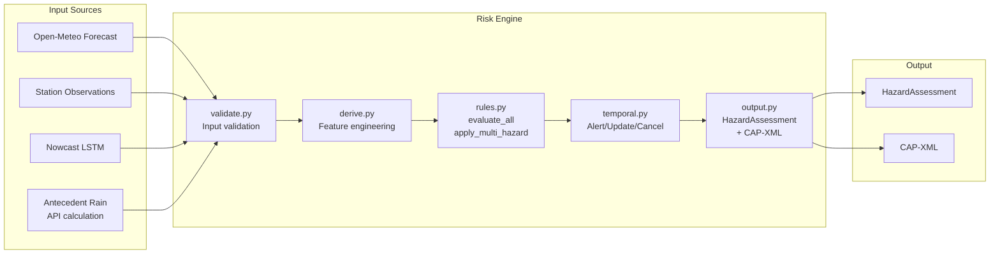

# Risk Engine — Risk Analysis Center

The risk engine is the **deterministic risk analysis center** of the Dien Bien Weather AI system. It implements Decision **18/2021/QĐ-TTg** (Thủ tướng Chính phủ) to evaluate commune-level hazards from weather data. **No LLM or AI is involved in risk level determination** — the engine is a rule-based system that is transparent, auditable, and reproducible.

---

## 1. File Map

| File | Purpose |
|------|---------|
| `engine.py` | **Entry point**: `evaluate()` — validates, runs rules, temporal logic, returns `HazardAssessment` |
| `schemas.py` | Input/output JSON Schema (`INPUT_SCHEMA`, `OUTPUT_SCHEMA`), dataclasses (`CommuneState`, `HazardState`, `HazardAssessment`, `RiskEngineInput`) |
| `rules.py` | **Rule evaluation**: `load_thresholds()`, `evaluate_table()`, `evaluate_all()`, `apply_multi_hazard()` |
| `derive.py` | **Feature derivation**: calculates `eff_rain_24h`, `api`, `saturated`, `cold_episode`, `frost_risk`, `fog_likely` |
| `temporal.py` | **Temporal logic**: `apply_temporal()` — handles Alert/Update/Cancel transitions, cooldown, clearing |
| `validate.py` | **Input validation**: validates payload against JSON Schema, checks physical ranges |
| `output.py` | **Output construction**: `build_output()` — assembles assessment with provenance, colors, CAP-XML |

External config: `config/thresholds.yaml` (version `qd18-v1.0.3`) — the rule table for all 5 hazard types.

## 2. Data Flow



### Step-by-step data flow

1. **Data sources** are assembled by `backend/pipeline/assemble.py` into a `RiskEngineInput` payload with: observations, 7-day forecast, antecedent rain data, nowcast results, and commune metadata.

2. **Validation** (`validate.py`): The input is validated against `INPUT_SCHEMA` (JSON Schema draft 2020-12). Physical range checks ensure all values are within plausible bounds (e.g., `rain_24h_mm` [0, 1000], `temp_c` [-15, 50]).

3. **Feature derivation** (`derive.py`): Derives composite features from raw inputs:
   - `eff_rain_24h` — effective 24h rainfall (blend of observations + forecast)
   - `api_mm` — antecedent precipitation index (k=0.85)
   - `saturated` — soil saturation state based on antecedent rain days
   - `cold_episode_min_mean_c` / `cold_episode_duration_days` — cold spell detection
   - `frost_risk` — frost likelihood from temp, cloud, wind
   - `fog_likely` — fog proxy from RH, wind, dewpoint spread
   - `fcst_or_eff_rain_24h` — forecast or effective rain for heavy rain rules

4. **Rule evaluation** (`rules.py`): `evaluate_all()` runs all 5 hazard rule tables. Each rule has bounds with `gte`/`gt`/`lte`/`lt`/`eq`/`in` operators. Multi-hazard compounding in `apply_multi_hazard()`: if both `lu_quet_sat_lo` ≥ 2 and `mua_lon` ≥ 2, level is incremented by 1.

5. **Temporal logic** (`temporal.py`): Handles Alert/Update/Cancel transitions with cooldown and clearing logic. Prevents duplicate alerts via idempotency cache.

6. **Output** (`output.py`): Builds `HazardAssessment` with `risk_level` (0–5), `risk_color`, `msg_type` (Alert/Update/Cancel), `output_class` (public_warning/official_advisory/heartbeat), `requires_human_approval`, provenance trace, and CAP-XML string.

## 3. Input Format

The risk engine accepts `RiskEngineInput` payloads conforming to `INPUT_SCHEMA`. Example for Mường Pồn commune (`tests/fixtures/muong_pon_2024.json`):

```json
{
  "schema_version": "1.0",
  "tick_id": "muong_pon_2024_tick_00",
  "evaluated_at": "2024-07-25T06:00:00Z",
  "commune": {
    "code": "muong_pon",
    "name": "Xã Mường Pồn",
    "region_qd18": 1,
    "susceptibility": "high",
    "susceptibility_source": "geo_data.py",
    "elevation_mean_m": 720,
    "timezone": "Asia/Ho_Chi_Minh"
  },
  "observations": {
    "source": "station_mock",
    "observed_at": "2024-07-25T06:00:00Z",
    "quality": "fresh",
    "rain_24h_mm": 145.0
  },
  "forecast": {
    "source": "open_meteo_best_match+qm_v1",
    "issued_at": "2024-07-25T00:00:00Z",
    "model_run": "2024-07-25T00:00",
    "hourly": {
      "time": ["2024-07-25T01:00", ...],
      "precip_mm": [5.0, ...],
      "temp_c": [24.0, ...]
    }
  },
  "antecedent": {
    "rain_days_prior": 3,
    "rain_day_threshold_mm": 16.0,
    "api_mm": 85.0,
    "days_since_data_gap": 30
  },
  "config_ref": {
    "threshold_table_version": "qd18-v1.0.3",
    "threshold_table_sha256": "<sha256>"
  }
}
```

## 4. Output Format

Each evaluation produces a list of `HazardAssessment` objects. Real output from the Muong Pon scenario (level 3 flash flood warning):

```json
{
  "schema_version": "1.0",
  "assessment_id": "muong_pon_2024_tick_00_lu_quet_sat_lo",
  "tick_id": "muong_pon_2024_tick_00",
  "commune_code": "muong_pon",
  "hazard_type": "lu_quet_sat_lo",
  "risk_level": 3,
  "risk_color": "da_cam",
  "output_class": "public_warning",
  "msg_type": "Alert",
  "requires_human_approval": true,
  "status": "Exercise",
  "triggered_rules": [
    {
      "rule_id": "qd18.art46.kv1.r2c",
      "legal_ref": "Dieu 46, QD 18/2021/QD-TTg - rui ro cap 3, khu vuc 1",
      "level": 3,
      "inputs": {"eff_rain_24h": 250.0, "rain_days_prior": 3, "susceptibility": "high"}
    }
  ],
  "provenance": {
    "engine_version": "1.0.2",
    "threshold_table_sha256": "<sha256>",
    "pipeline_source": "scenario:muong_pon",
    "nowcast_confidence": 0.6
  },
  "cap_xml": "<?xml version=\"1.0\" encoding=\"UTF-8\"?><alert xmlns=\"urn:oasis:names:tc:emergency:cap:1.2\">..."
}
```

## 5. Hazard Types & Rule Sources

| Hazard | Type Code | Legal Source | Rules |
|--------|-----------|--------------|-------|
| Flash flood / landslide | `lu_quet_sat_lo` | Điều 46, QĐ18 | 15 rules (base + extrapolated + pre-warning) |
| Heavy rain | `mua_lon` | Điều 44, QĐ18 | 7 rules |
| Severe cold | `ret_hai` | Điều 53, QĐ18 | 3 rules (pending legal verification) |
| Frost | `suong_muoi` | Điều 53, QĐ18 | 1 advisory rule |
| Fog | `suong_mu` | Điều 5, QĐ18 | 2 rules (observed + proxy) |
| Heartbeat | `heartbeat` | Internal | 1 rule (commune alive signal) |

## 6. Idempotency & Replay

The engine caches results by `tick_id` (hash-based). Replaying the same input returns the cached assessment. If the payload hash differs for the same `tick_id`, the engine raises `ValidationError` — this prevents accidental re-evaluation with different data.

This design enables byte-identical replay verification:

```bash
# Run a scenario and replay the result
python -m pipeline.run --source scenario --scenario muong_pon --ticks 2
# Then replay (verify byte-identical):
python -m pipeline.run --replay runs/<timestamp>_scenario/
```

## 7. Unit Tests (Root `tests/`)

The risk engine is tested extensively with property-based testing:

- `test_e2e.py` — End-to-end pipeline: fake HTTP transport + real engine + real model
- `test_determinism.py` — Deterministic output verification
- `test_fuzz.py` — Hypothesis property-based fuzz (1000 cases default, 100K with `RUN_RISK_ENGINE_SLOW=1`)
- `test_golden_muong_pon.py` — Golden test against Muong Pon 2024 scenario
- `test_pipeline_units.py` — Pipeline unit tests
- `test_properties.py` — Invariant property tests
- `test_purity.py` — Input/output purity tests (idempotency)
- `test_rules_rows.py` — Rule table coverage tests
- `test_temporal.py` — Temporal transition tests
- `test_validate.py` — Input validation tests
- `test_aggregate.py` — Output aggregation tests
- `test_model.py` — Nowcast model load/predict
- `test_run.py` — Pipeline runner tests

```bash
cd <repo-root>
pip install -e .                    # Install risk-engine package
pytest tests/ -v                     # Run all risk engine + pipeline tests
pytest tests/test_golden_muong_pon.py -v  # Muong Pon golden scenario
```

## 8. Configuration

The rule tables are loaded from `config/thresholds.yaml`. The engine verifies the file integrity via SHA-256:

```python
# From risk_engine/rules.py:
thresholds = load_thresholds("config/thresholds.yaml", expected_sha256="<sha256>")
# Raises ConfigIntegrityError if the file content has changed
```

Engine parameters in `thresholds.yaml`:
- `api_saturation_pivot_mm`: 60.0 (AP calibration point)
- `cooldown_hours`: 6 (minimum hours between same-hazard alerts)
- `lowering_ticks`: 3, `lowering_rain_guard_mm_h`: 5.0 (level lowering logic)
- `observation_fresh_hours`: 2, `observation_missing_hours`: 6
- `frost_temp_c`: 4.0, `frost_cloud_cover_pct`: 30.0
- `fog_rh_pct`: 97.0, `fog_visibility_m`: 1000.0
